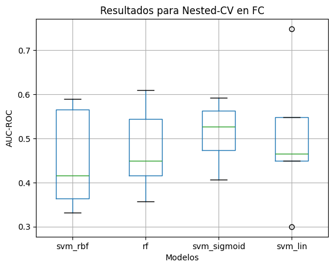
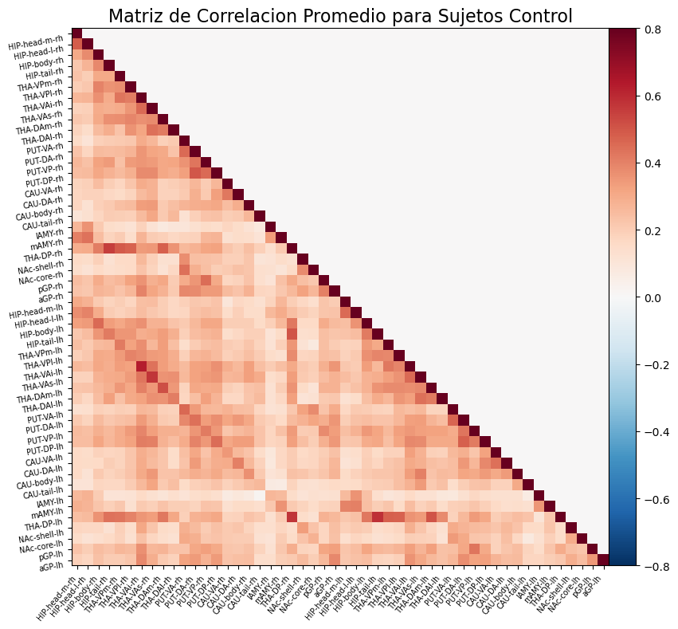
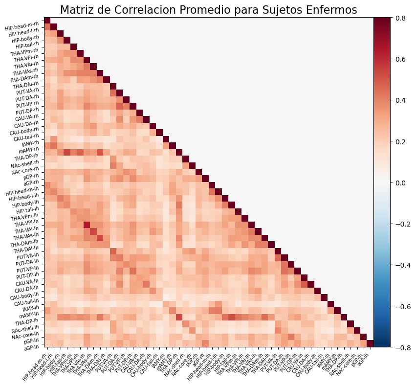

# Post-analysis
--------------

## Integrantes

- Pablo Groisman [pablogroisman](https://github.com/pablogroisman)
- Nicolás Yanovsky [nyanovsky](https://github.com/nyanovsky)
- Nicolás Rozenberg [Nicopiwi](https://github.com/Nicopiwi)

# Docente

Federico Raimondo [fraimondo](https://github.com/fraimondo)

#
Para esta parte del trabajo, probamos los modelos explicados en la preentrega, tanto utilizando conectividad funcional con PCA reducido a 50 dimensiones, como ALFF en reposo. Para cada uno, realizamos nested cross validation con 5 folds, y los hiperparámetros que probamos son los siguientes:

Para los [clasificadores basados en SVMs](https://scikit-learn.org/stable/modules/generated/sklearn.svm.SVC), con Kernel lineal, Radial Basis Function (RBF) y Sigmoide, probamos un espacio logarítmico de 10 opciones para el parámetro de regularización `C`, y el mismo espacio para el coeficiente gamma de los kernels RBF y Sigmoide. Para el [Random Forest](https://scikit-learn.org/stable/modules/generated/sklearn.ensemble.RandomForestClassifier.html), probamos `{10,30,70,100,200}` como la cantidad de estimadores, y para la profundidad máxima, probamos con 5, 25, 50 niveles, y una cantidad ilimitada de niveles. 

Para esta parte del trabajo realizamos la extracción de features para una única parcelación (TianxS3x3TxMNI6thgeneration) debido a cierta dificultad al correr los datos (por una cuestion el tiempo de computo) y debido a errores a la hora de correr para otras parcelaciones.

## Resultados
### Clasificacion de sujetos enfermos usando conectividad funcional
 Los resultados muestran valores de AUC-ROC para 5-fold nested cross validation para distintos modelos. 

 Se obtuvieron valores mediocres de AUC-ROC en todos los modelos, por lo que la eleccion del modelo final fue levemente arbitraria: los cuatro modelos tienen performances similares en general, con alta variacion tambien (entre splits).

  El modelo final elegido fue un Random Forest (debido a su mayor interpretabilidad) construido con 70 arboles de altura maxima 5. Seleccionamos sus hiperparametros realizando grid search sobre la grilla ya mencionada. \
  Finalmente se obtuvo un AUC en el set de testeo de $0.574$ .

### Clasificacion de sujetos enfermos usando ALFF
De manera similar, en el caso de la clasificacion de sujetos enfermos usando ALFF, conseguimos los siguientes resultados.

En este caso se obtuvieron valores levemente mejores en comparacion con los obtenidos usando FC. En este caso se descarto al Random Forest por presentar mayor variabilidad entre splits que los demas modelos.

En este caso se eligio como modelo final un SVM con kernel rbf (el de mayor media de AUC) de parametros $C=0.46, \gamma = 0.001$ seleccionados usando grid search en la grilla ya mencionada. \
El AUC obtenido para el set de testeo fue de $0.532$ .

## Conclusiones

Los resultados obtenidos en el estudio no resultan buenos para afirmar que es posible predecir la existencia de desórdenes neuropsiquiátricos como lo son TDAH, Trastorno Bipolar y Esquizofrenia a partir de la fluctuación de sangre en el cerebro durante el reposo utilizando herramientas de machine learning.

Creemos que existen distintos factores que fueron determinantes para el desarrollo del trabajo y que pudieron haber afectado negativamente los resultados. Entre ellos encontramos:
- La calidad de los datos puede no ser buena. Al utilizar un estudio del que lo único que tenemos es un artículo explicando los procedimientos, puede ser que existan fallas que no estamos contemplando a la hora de utilizar los datos.
- La parcelación utilizada puede ser la incorrecta para el objetivo. Es posible que la parcelación utilizada no contemple o mezcle regiones de interés que pueden ser fundamentales a la hora de determinar correlaciones entre el estudio y los trastornos.
- Para el estudio en base a la conectividad funcional realizamos un PCA que redujo la dimensión del espacio de 1275 a 50. En este paso pudimos haber perdido mucha información y por lo tanto concluir en modelos con peor performance. La cantidad de dimensiones con menos varianza era superior pero al tener solo un 20% de los datos para test (50 sujetos), necesitamos usar un PCA con menos dimensiones que sujetos de test para poder aplicar el mismo procesamiento a estos datos.
- La hipotesis de la que partimos carecia de sustento. Por ejemplo, mostramos a continuacion las matrices FC promediadas para sujetos control y para sujetos enfermos, las cuales casi no presentan diferencias.

